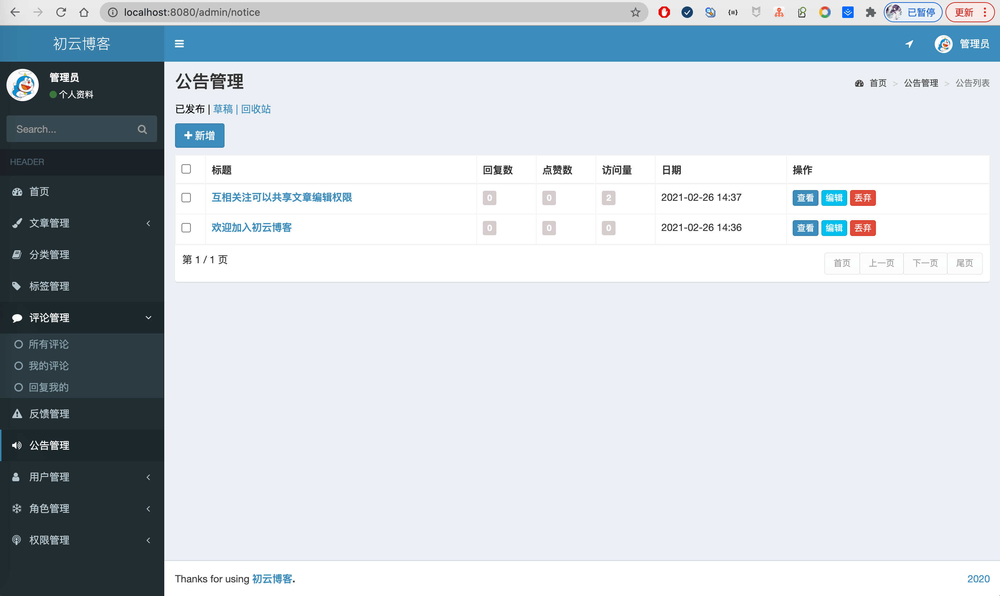

基于SSM实现的博客系统，增强版，该项目为初云博客SSM版本，持续更新。 
预览地址：[https://ssmblog.liuyanzhao.com](https://ssmblog.liuyanzhao.com)  
详细介绍地址：[https://liuyanzhao.com/1365230094691471361.html](https://liuyanzhao.com/1365230094691471361.html)  

初云博客各种版本地址：[http://github.com/saysky/chuyunblog](http://github.com/saysky/chuyunblog)  

## 功能介绍
- 1、前台功能
- 最新文章、最新公告、热门文章、我发布的文章、我的订阅(关注用户发的文章)、我的收藏、我的点赞
- 文章详情、文章点赞、文章点踩、文章收藏、文章举报、文章评论、评论回复、评论点赞、评论点踩
- 我的关注用户、我的粉丝用户
- 热门分类、热门标签、活跃用户
- 心情签到、资料下载
- 
- 2、后台用户功能
- 文章管理、发布文章、编辑文章(可以编辑互相关注的用户的文章)、删除文章
- 评论管理、我发布的评论、评论我的、反馈查看
- 用户登录、注册、找回密码、个人信息修改、密码修改
- 文档资料管理 

- 3、后台管理员功能（包含普通用户的所有功能）
- 所有文章管理、增删改查、置顶、推荐
- 所有评论管理
- 分类管理、标签管理、公告管理、反馈管理、用户管理...
- 所有文档资料管理

备注：可以帮忙新增功能和删除功能

## 技术组成
- Spring
- SpringMVC
- MyBatis
- Thymeleaf
- MySQL

## 部署准备
- JDK1.8 +
- MySQL5.6+
- Tomcat7+  (需要在server.xml里设置UTF-8编码)
- 数据库可视化工具，如SQLYog、Navicat等
- 开发工具，推荐 IDEA
- IDEA需要安装 lombok 插件

## 部署步骤
博主已经录制了视频，联系博主获取

- 创建数据库 ssm_blog_plus，数据库编码 utf8，字符集 utf8_general_ci
- 导入SQL，通过Navicat，选择数据库，右键运行SQL文件
- 通过 IDEA 导入项目，打开 SSMBlogPlus目录，IDEA能识别是 Maven 项目，等依赖下载完毕
- 修改数据库配置，db.properties
- 修改上传文件配置 AttachmentController.java 里的 rootPath
- IDEA配置 tomcat 运行项目，需要

## 项目截图
1-首页.png

2-公告.png

3-热门文章.png

4-我发布的.png

5-我的订阅.png

6-我的收藏.png

7-我的点赞.png

8-我的关注.png

9-我的粉丝.png

10-活跃用户.png

11-热门标签.png

12-登录.png

13-注册.png

14-找回密码.png

15-文章管理.png

16-文章编辑.png

17-标签管理.png

17-分类管理.png

18-评论管理.png

19-反馈管理.png

20-公告管理.png

21-用户管理.png

22-文章详情.png

23-文章详情2.png

24-普通用户后台.png

25-心情签到.png

26-资料下载前台页面.png

27-管理员后台资料管理.png

28-用户后台资料管理.png

## 代码获取方式
- 联系博主微信 847064370
- 可以提供完整代码、如果需要帮忙加功能或者减功能也可以帮忙实现
- 远程代码讲解和论文也可以考虑提供

